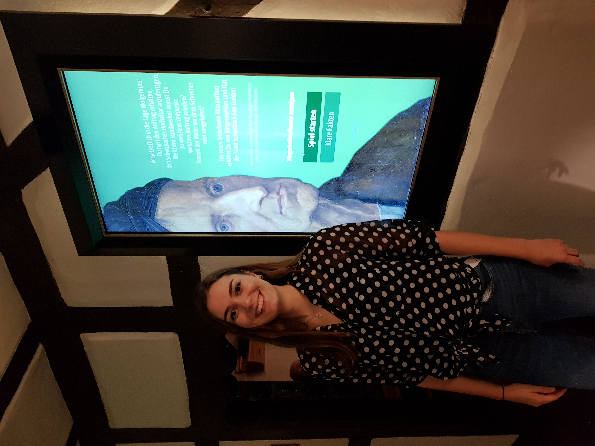
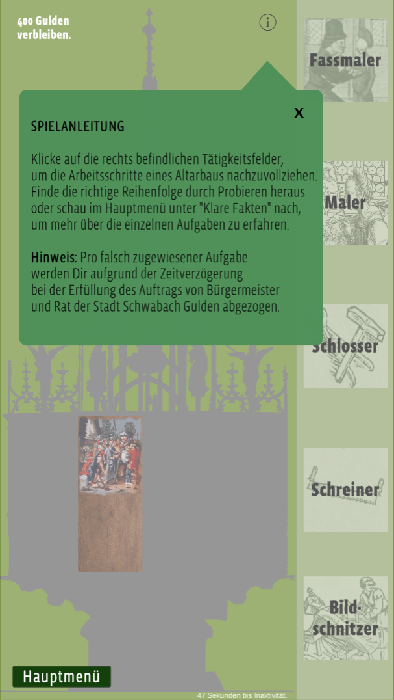
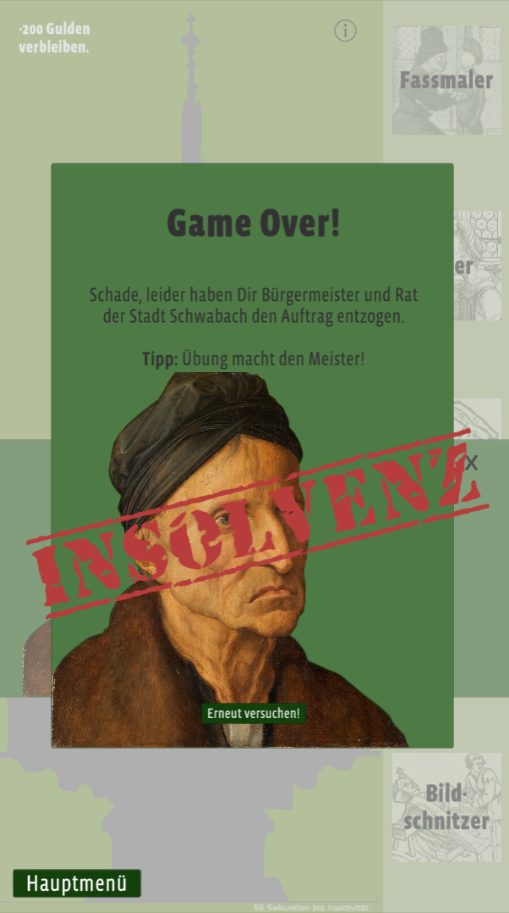

# 🎨 Media Station for Michael Wolgemut and the Schwabach Altarpiece

This media station was developed for the **Albrecht-Dürer-Haus** as part of the exhibition **"Michael Wolgemut - Mehr als Dürers Lehrer"**. It offers a structured way to explore the artistic legacy of **Michael Wolgemut and his workshop**, with a special focus on the **Schwabach Altarpiece**.

The application follows a **gamification** approach, allowing visitors to engage interactively with historical content.

For more details about the exhibition, visit the Website of the **Museen der Stadt Nürnberg**:\
🔗 [Official Website](https://museen.nuernberg.de/duererhaus/kalender-details/michael-wolgemut-1674)

---

## 🖥️ Software Overview

This software allows visitors to interact with historical artworks and information in a modern and intuitive way. Features include:

* **Touchscreen Interaction** – Easy-to-use interface for museum visitors\
* **Historical Content** – Information and images related to Michael Wolgemut, his workshop, and the Schwabach Altarpiece\
* **Gamification** – Interactive game elements for an engaging learning experience\
* **Portrait Mode** – Designed for a vertical screen layout\
* **Offline Functionality** – Can run without an internet connection

---

## 🛠 Installation & Setup

This project was developed using **Unity Editor Version 2019.2.5f1**.

**Note:** Using a different Unity Editor version than the one used during development may cause compatibility issues.

---

## 📜 License
This project is licensed under the Creative Commons (CC BY-NC-SA) license.

For more details, see the [Creative Commons License](https://creativecommons.org/licenses/by-nc-sa/4.0/).

---

## 📬 Contact
For any inquiries or collaboration requests, feel free to reach out:

👤 Katharina Hefele

📧 [kathefele@gmail.com](kathefele@gmail.com)

---

## 📸 Screenshots

*Media station during the exhibition at the Albrecht-Dürer-Haus.*

*Screenshot from the game showing the game instructions.*

*Screen displayed upon successful game completion.*

*Sad, insolvent Wolgemut at Game Over.*
